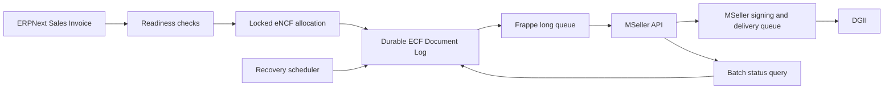

# DGII e-CF for Frappe

Provider-agnostic electronic invoicing for ERPNext in the Dominican Republic.
The app converts submitted `Sales Invoice` documents into DGII electronic
fiscal receipts (e-CF/e-NCF), delivers them through a pluggable gateway, tracks
their fiscal lifecycle, and produces the Dominican printed representation.

> **Production control:** installation is inert by default. No provider traffic
> or fiscal sequence consumption occurs until the site feature flag and a
> company's provider settings are both enabled.

## Scope and support status

| Capability | Status |
| --- | --- |
| Outbound e-CF 31, 32, 33, and 34 | Supported |
| MSeller gateway (`TesteCF`, `CerteCF`, `eCF`) | Supported |
| Multiple ERPNext companies | Supported and isolated per company |
| Durable asynchronous delivery and recovery | Supported |
| Batch status synchronization | Supported |
| Dominican e-CF print format with QR | Supported |
| Received-document audit references | Supported |
| Automatic inbound e-CF ingestion | Not implemented |
| e-CF types 41, 43, 44, 45, 46, and 47 | Not implemented by the builder |
| Signed XML download | Pending a public MSeller download endpoint |

The current package version is `0.1.0`. It is tested on Frappe and ERPNext v16
and requires Python 3.10 or newer.

## Operational ownership

| Concern | Owner/system |
| --- | --- |
| Application and integration code | Invntio — `support@invntio.com` |
| Gateway API, signing, and DGII delivery | [MSeller e-CF](https://mseller.app) |
| Fiscal authorization and sequence ranges | Each issuing taxpayer / DGII |
| Durable fiscal and delivery state | Site MariaDB through Frappe DocTypes |
| Background execution | Frappe workers and Redis Queue |
| Secrets at rest | Frappe `Password` fields |

## Architecture



The integration has two independent failure boundaries:

1. **Frappe → MSeller:** managed locally with a transactional outbox, Redis
   locking, classified errors, capped backoff, and query-before-retransmit.
2. **MSeller → DGII:** managed by MSeller after it has received and signed the
   document. Frappe polls the resulting status instead of repeatedly submitting
   an in-flight document.

No MSeller network request runs inside the invoice commit. The eNCF and outbox
row are persisted first; external delivery happens in a background worker.

### Frappe code layout

- Owned DocTypes keep their Python controller, form/list JavaScript, and
  DocType-specific helpers under `dgii_ecf/doctype/<doctype>/`; Frappe loads
  these files by naming convention.
- Native ERPNext `Sales Invoice` is extended explicitly through `doc_events`
  and `doctype_js`; the app never shadows ERPNext's controller.
- `api.py` orchestrates public fiscal commands, `delivery.py` owns the shared
  delivery state machine/audit chain, `providers/` owns gateway contracts, and
  `tasks.py` contains scheduler entry points.
- Tests use Frappe 16's `UnitTestCase` and `IntegrationTestCase`; the deprecated
  legacy test category is not used.

## Features

- Concurrency-safe eNCF allocation with a database row lock.
- Separate ranges by company, environment, and e-CF type.
- Durable outbox recovery if Redis, a worker, or the provider is unavailable.
- Same-eNCF retry without consuming a second fiscal sequence.
- Query-by-eNCF before retransmitting an uncertain request.
- Exponential backoff of 1, 2, 5, 15, 30, then 60 minutes.
- Configurable cross-worker request pacing; default 5 requests/second.
- Batch status polling, up to MSeller's 100-document API limit.
- Automatic bearer-token caching and one refresh attempt after HTTP 401.
- Rejection notification to the source invoice owner.
- Manual retry for `ERROR`, `Rechazado`, and `UNCONFIRMED` documents.
- Cancellation guard for issued or in-flight e-CFs.
- Full request/response, QR, security code, signing, and retry metadata.
- Native Dynamic Link references for issued and received fiscal documents.
- Spanish source translations and a Dominican Sales Invoice print format.

## Requirements

- Frappe and ERPNext v16.
- Running Redis Queue, Frappe workers, and scheduler.
- A Dominican ERPNext `Company` with a valid RNC and linked fiscal address.
- An MSeller account, certificate, and API key for the selected environment.
- DGII-authorized sequence ranges owned by each issuing taxpayer.
- Completed DGII/MSeller certification before production activation.

## Installation

```bash
bench get-app https://github.com/invntio/dgii-ecf.git
bench --site your-site install-app dgii_ecf
bench --site your-site migrate
```

For an upgrade:

```bash
cd apps/dgii_ecf
git pull
cd ../..
bench --site your-site migrate
bench restart
```

## Enterprise configuration

Configure in this order. Enable production only after every readiness check is
green.

### 1. Company fiscal identity

For every issuing `Company`:

- Set `Country` to `Dominican Republic`.
- Set its 9- or 11-digit RNC/tax ID.
- Link a fiscal `Address` containing at least `address_line1`.
- Confirm the company and customer master data used in fiscal documents.

### 2. Gateway login

`ECF Gateway Account` is a System Manager-only Single DocType containing the
platform MSeller email, password, and base URL. One platform login may serve
multiple companies; the per-company API key provides tenant scoping.

Standalone installations may instead enable custom credentials in each
company's `ECF Provider Settings`.

### 3. Per-company provider settings

Create one `ECF Provider Settings` record per company:

The **DGII ECF** sidebar exposes this list explicitly as **Provider Settings**;
it is not dependent on Frappe's three-DocType automatic module limit. Access
still follows the DocType permissions, so the platform-wide Gateway Account
remains visible only to System Managers.

- Provider: `MSeller`.
- Environment: `TesteCF`, `CerteCF`, or production `eCF`.
- API key for that exact environment.
- API request rate for the contracted MSeller plan.
- Optional custom login credentials.

The default rate is 5 requests/second, the conservative Free-plan limit
confirmed by MSeller. Raise it only when the contracted plan allows it.

### 4. Fiscal sequence ranges

Create `ECF Sequence Range` records using the ranges authorized for that
taxpayer. Ranges are scoped by:

- Company.
- MSeller environment.
- e-CF type.
- First and last sequence.
- Expiration date.

The app rejects overlapping active ranges, expired ranges, exhausted ranges,
and concurrent duplicate allocation. Test, certification, and production ranges
are separate fiscal namespaces.

### 5. Activate the site

```bash
bench --site your-site set-config dgii_ecf_enabled 1
```

Disable all provider traffic with:

```bash
bench --site your-site set-config dgii_ecf_enabled 0
```

The feature flag and `ECF Provider Settings.enabled` must both be active. Keep
the site disabled during initial installation, unsafe development data, and
pre-certification work.

## Invoice behavior

Before submission, the app verifies:

- Company RNC and fiscal address.
- Enabled provider settings and environment API key.
- Usable gateway credentials.
- Active, non-expired, non-exhausted sequence range.
- Buyer RNC/cédula for type 31.

The Customer and Sales Invoice field `Requires Fiscal Credit Receipt` selects
type 31 when enabled; otherwise the default sale is type 32. ERPNext's native
`is_debit_note`, `is_return`, and `return_against` fields drive types 33 and 34
and their original-document references.

Dominican invoices use Spanish and default to the `DGII e-CF Sales Invoice`
print format. Fiscal values come from the persisted request payload; the printed
representation adds the MSeller QR, security code, signing date, and status.

## Delivery state machine

| State | Meaning | Automated behavior |
| --- | --- | --- |
| `Pending` | Durable outbox row; no confirmed POST | Dispatch through `long` queue |
| `SUBMITTING` | Attempt persisted before external I/O | Reconcile if stale for 10 minutes |
| `UNCONFIRMED` | Connection/provider outcome is uncertain | Query by eNCF before retransmission |
| `RECIBIDO` | MSeller received the document | Poll only |
| `PROCESANDO` | Pending/queued/processing at MSeller | Poll only |
| `Aceptado` | Terminal fiscal success | Never retransmit |
| `Aceptado Condicional` | Terminal conditional acceptance | Never retransmit |
| `Rechazado` | Correctable remote failure | Notify; allow authorized manual retry |
| `ERROR` | Permanent authentication, validation, or unknown error | Manual intervention |

MSeller confirmed that a document may be received and re-signed again while it
is pending, queued, errored, or rejected. An accepted or conditionally accepted
eNCF is protected locally and MSeller rejects its retransmission.

## Error and retry policy

| Failure | Classification | Action |
| --- | --- | --- |
| Connection failure / timeout | Uncertain | Query by eNCF, then resend only if absent |
| HTTP 429 | Transient | Apply local capped backoff |
| HTTP 5xx | Uncertain provider failure | Query before retry |
| HTTP 400 | Validation/permanent | Stop automatic retry |
| Persistent HTTP 401 | Authentication/permanent | Stop and correct credentials |
| HTTP 403 | Authorization/permanent | Stop and correct API key/permissions |
| Remote `Rechazado` or `ERROR` | Correctable | Review cause, then use manual Retry |

MSeller does not provide `Retry-After`; the app calculates its own backoff. A
Redis lock prevents simultaneous POSTs for the same outbox row, while a second
cross-worker limiter enforces the configured per-company request rate.

## Scheduled operations

| Schedule | Task |
| --- | --- |
| Every minute | Dispatch unsent outbox rows and reconcile due/stale attempts |
| Every minute | Query only due non-terminal documents through MSeller batch status (adaptive cadence) |
| Every 5 minutes | Evaluate stalled-document alerts |
| Daily | Mark expired eNCF ranges as `Expired` |

Workers must consume the `long` queue. A healthy scheduler is required for
automatic recovery and status synchronization.

## Audit, monitoring, and backups

`ECF Document Log` is the source of truth for fiscal delivery. It stores:

- Company, direction, source document, e-CF type, and eNCF.
- Immutable original request JSON, request SHA-256, and sanitized provider response.
- MSeller track ID, security code, QR URL, signed date, and signed XML path.
- Submission count, last attempt, next retry, HTTP status, error class, and
  operator-facing error.
- Append-only delivery events linked by a sequence and SHA-256 hash chain.

Recommended operational views:

- `UNCONFIRMED`: investigate items older than the configured retry window.
- `ERROR`: correct credentials, permissions, or payload validation.
- `Rechazado`: inspect the response before manual retry.
- `Pending`/`SUBMITTING`: verify workers, Redis, and scheduler health.
- Active sequence ranges: monitor remaining numbers and expiration dates.

Back up the complete Frappe database. Never rely only on Redis or worker history;
the database contains the durable fiscal request, response, and recovery state.
MSeller currently exposes the signed XML path but not a public download endpoint.

See [MSeller delivery resilience](docs/mseller-delivery-resilience.md) for the
provider-confirmed behavior and [e-CF operations runbook](docs/ecf-operations-runbook.md)
for diagnosis, alerts, safe retry, and audit verification.

## Security controls

- API keys and passwords use Frappe `Password` fields; never place them in code,
  fixtures, screenshots, test output, or support reports.
- Platform credentials are restricted to `System Manager`.
- Company-specific login overrides use permission level 1.
- Bearer tokens are cached in Redis by login identity and environment for 45
  minutes and refreshed once after an expired-token response.
- Use HTTPS for every non-local provider endpoint.
- Apply least-privilege access to `ECF Document Log`, provider settings, and
  sequence ranges.
- Rotate credentials and certificates using an approved operational process.
- Review backups, database encryption, retention, and restore tests under the
  organization's security policy.

## Validation-only warning

`dgii_ecf.api.validate_only` calls MSeller with `?validate=true`, but MSeller has
confirmed that validation-only may be disabled for an account. In that case the
provider can process and sign the placeholder document. The integration detects
a returned submission receipt and raises a visible error, but operators must
still treat validation calls as potentially consumptive until MSeller confirms
the feature is enabled for that account.

Do not use validation-only as a production safety boundary.

## Fiscal document references

`ECF Document Log` uses Frappe Dynamic Links (`reference_doctype` and
`reference_name`) instead of copying references into ERPNext core DocTypes.

- Issued e-CFs link to `Sales Invoice`.
- Received e-CF audit records may link to `Purchase Invoice`.
- Debit and credit notes link to the modified `ECF Document Log`.
- Sales and Purchase Invoice dashboards expose their related e-CF logs.
- Duplicate received eNCFs from the same issuer are rejected.

The app does not yet receive documents automatically; the model is ready for a
future inbound connector.

## Provider interface

Business logic depends on `EcfProvider`, not MSeller-specific response paths.
A provider must implement:

```python
authenticate() -> str
send(ecf_json, validate=False) -> EcfResult
get_status(encf) -> EcfResult
get_status_batch(encfs) -> list[EcfResult]
```

Add the provider class to `dgii_ecf/providers/registry.py` and normalize all
gateway-specific states into the values used by `ECF Document Log`.

## Testing

The suite mocks MSeller transport and performs no external provider calls:

```bash
bench --site your-site run-tests --app dgii_ecf
```

Coverage includes payload construction, sequence locking/exhaustion, readiness,
credential resolution, provider mapping, printing, references, polling,
transactional outbox recovery, error classification, backoff, authentication,
and query-before-retransmit.

When the site feature gate is enabled, a Dominican Company may save Sales
Invoice drafts, but submission is blocked until its provider, credentials,
fiscal data, and authorized sequence are ready. Submission allocates the e-NCF
and persists the e-CF outbox row before commit; network/provider delivery is
asynchronous and retryable. A provider outage therefore produces a generated
e-CF pending transmission, not a submitted invoice without e-CF.

Live evidence and its limitations are recorded in
[the MIGOR TesteCF smoke report](docs/mseller-live-smoke-migor-2026-07-13.md).
The report intentionally contains no credentials, tokens, signed XML, or
customer personal data.

## Production checklist

- [ ] Taxpayer completed certification as an electronic issuer.
- [ ] Company RNC and fiscal address match its legal registration.
- [ ] Correct production `eCF` API key and certificate are active.
- [ ] Every required e-CF type has an authorized, unexpired range.
- [ ] MSeller request rate matches the contracted plan.
- [ ] Redis, `long` workers, scheduler, and database backups are monitored.
- [ ] Operators can filter and resolve `UNCONFIRMED`, `ERROR`, and `Rechazado`.
- [ ] Offline/recovery drill completed without consuming a duplicate eNCF.
- [ ] Printed QR/security-code representation verified.
- [ ] `dgii_ecf_enabled` activated only after the preceding checks pass.

## External documentation

- [MSeller integration overview](https://docs.ecf.mseller.app/docs/integration/overview)
- [MSeller authentication](https://docs.ecf.mseller.app/docs/integration/authentication)
- [MSeller document submission](https://docs.ecf.mseller.app/docs/integration/documents)
- [MSeller document queries](https://docs.ecf.mseller.app/docs/integration/document-queries)
- [MSeller integration best practices](https://docs.ecf.mseller.app/docs/resources/best-practices)

## License

MIT
